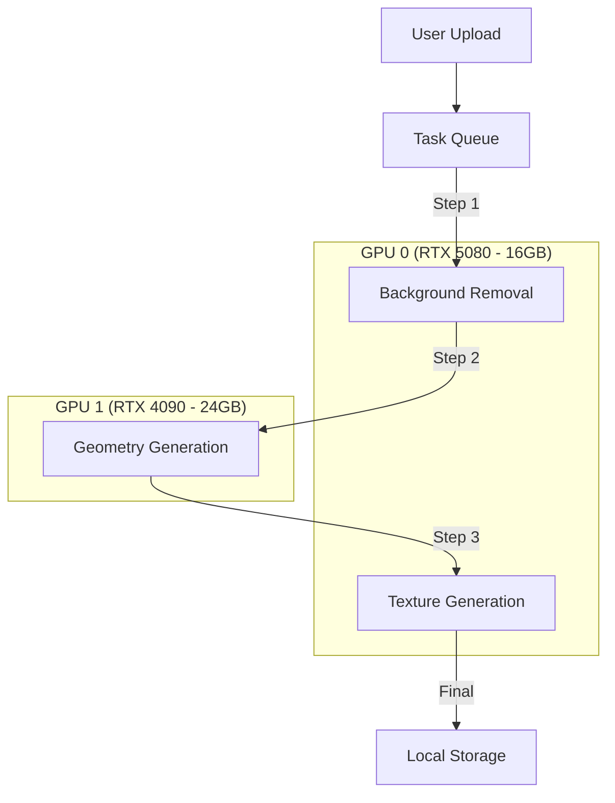

# ProtoScale-AI

<div align="center">


**Engineering-Grade Image-to-3D Conversion Platform for Manufacturing**

[Features](#key-features) • [Quick Start](#quick-start) • [Architecture](#system-architecture) • [Troubleshooting](#troubleshooting)

</div>

---

## Tujuan App

**ProtoScale-AI** adalah platform *Image-to-3D* berbasis AI yang dirancang untuk mengubah gambar 2D (foto, sketsa, atau AI-generated images) menjadi model 3D siap manufaktur. Aplikasi ini menggunakan teknologi **Hunyuan3D-2.1** (PBR) dari Tencent untuk menghasilkan geometri 3D berkualitas tinggi dengan support *Physically Based Rendering* yang dapat dikalibrasi dimensi nyatanya dan diekspor untuk **FDM 3D Printing**.

### Use Cases
- **Prototyping Cepat**: Ubah foto produk menjadi model 3D dalam hitungan menit
- **Reverse Engineering**: Dokumentasikan objek fisik menjadi model digital
- **Manufacturing**: Generate geometri produksi dari gambar teknik atau sketsa
- **Content Creation**: Buat aset 3D dari konsep 2D untuk gaming/VR/AR

### Key Differentiator
Berbeda dari tools AI art biasa, ProtoScale-AI fokus pada:
- **Engineering Workflow**: Pipeline terstruktur dari Upload → Generate → Calibrate → Export
- **Dimensional Accuracy**: Kalibrasi skala X/Y/Z dalam satuan milimeter (mm)
- **Dual-GPU Pipeline**: Arsitektur parallel processing untuk performa maksimal
- **Manufacturing-Ready**: Export STL yang kompatibel dengan slicer (Cura, PrusaSlicer, Bambu Studio)
- **Local Processing**: Semua proses dilakukan lokal di GPU Anda, privasi terjaga

---

## Quick Start

### Prerequisites

#### Hardware Requirements
Platform ini dioptimalkan untuk setup **Dual-GPU** untuk memisahkan beban kerja geometri dan tekstur, namun dapat berjalan pada single GPU.

- **Recommended (Dual GPU - Reference Setup)**:
  - **GPU 1 (Geometry)**: RTX 4090 (24GB VRAM) - Menangani Voxelization & Shape Generation
  - **GPU 0 (Texture/Util)**: RTX 5080 (16GB VRAM) - Menangani Background Removal & Texture Synthesis
- **Minimum (Single GPU)**:
  - NVIDIA GPU dengan 12GB+ VRAM (Balanced Quality, No Texture)
  - 16GB+ VRAM required untuk Texture Generation
- **RAM**: 32GB+ recommended
- **Storage**: 20GB+ free space (Model weights + Caches)

#### Software Requirements
- **OS**: Linux (Ubuntu 22.04+) atau Windows 11 dengan WSL2
- **Python**: 3.10 atau 3.11
- **Node.js**: 18.x atau 20.x
- **CUDA**: 12.x (cek dengan `nvidia-smi` dan `nvcc --version`)

---

### Installation

#### 1. Clone Repository

```bash
git clone <repository-url>
cd ProtoScale-AI
```

#### 2. Backend Setup

```bash
cd backend

# Create virtual environment
python3.10 -m venv venv
source venv/bin/activate  # On Windows: venv\Scripts\activate

# Install PyTorch (CUDA 12.8) - SESUAIKAN dengan CUDA version Anda
pip install torch torchvision --index-url https://download.pytorch.org/whl/cu128

# Install Hunyuan3D-2.1 (AI Model - PBR Version)
cd /home/gspe-ai3
git clone https://github.com/Tencent/Hunyuan3D-2.git Hunyuan3D-2.1
cd Hunyuan3D-2.1

# Verify structure (should have hy3dshape/ and hy3dpaint/)
ls -la hy3dshape/ hy3dpaint/

# Create symlink for checkpoint directory
ln -s hy3dpaint/ckpt ckpt

# Download RealESRGAN checkpoint if missing
cd ckpt
wget https://github.com/xinntao/Real-ESRGAN/releases/download/v0.2.1/RealESRGAN_x4plus.pth
cd ..

# Install backend dependencies
cd /path/to/ProtoScale-AI/backend
pip install -r requirements.txt
```

#### 3. Frontend Setup

```bash
cd frontend

# Install dependencies
npm install

# Configure API endpoint
# Edit .env file:
echo "VITE_API_URL=http://localhost:8077" > .env
```

---

### Running the Application

#### Terminal 1: Start Backend

```bash
cd backend
source venv/bin/activate

# Set environment variables (Dual GPU Config)
export GEOMETRY_DEVICE="cuda:1"  # RTX 4090
export TEXTURE_DEVICE="cuda:0"   # RTX 5080
export ENABLE_TEXTURE="true"

# Start FastAPI server
uvicorn app.main:app --host 0.0.0.0 --port 8077 --reload
```

#### Terminal 2: Start Frontend

```bash
cd frontend

# Development server
npm run dev
```

---

## Key Features

### 1. Hunyuan3D-2.1 (PBR) Exclusive
Platform menggunakan **Hunyuan3D-2.1** secara eksklusif dengan fitur:
- **Physically Based Rendering**: Material realistis dengan support Albedo, Normal, Metallic, dan Roughness maps
- **Enhanced Lighting**: Multi-source lighting setup untuk optimal texture visualization dengan ambient light intensities hingga 5.0
- **Enhanced Stability**: Triple-layer VRAM cleanup mencegah OOM errors
- **Optimized Pipeline**: Simplified codebase tanpa version switching overhead

**Legacy Note**: Jobs dari v2.0 akan ditandai sebagai "DEPRECATED" dan tidak dapat diproses ulang. Silakan upload ulang untuk regenerasi dengan v2.1.

### 2. Quality Presets
Pilih keseimbangan antara kecepatan dan kualitas:

| Preset | Est. Time | Face Count | Features |
|--------|-----------|------------|----------|
| **Draft** | ~1 min | 5K | Low Poly, No Texture |
| **Balanced** | ~3 min | 50K | Medium Poly, Mesh Repair |
| **High** | ~4 min | Unlimited | Full Detail, Texture Enabled |
| **Ultra** | ~4 min+ | Unlimited | Max Resolution, Higher Guidance |

### 3. Advanced 3D Preview & Analysis
- **Inspector Panel**: Kontrol penuh atas properti visual, grid, dan lighting dengan multi-tab interface.
- **Retexture Controls**: Advanced texture generation dengan kontrol resolution (512-2048px), views (3/4/6), dan optional seed untuk hasil reproducible.
- **Mesh Analysis**: Pengecekan otomatis untuk *Watertight* dan *Manifold* geometry (krusial untuk 3D printing).
- **Transform Controls**: Scale (uniform/per-axis), rotate, dan visualisasi dimensi real-time dengan live bounding box calculation.

### 4. STL Printer Simulation
- **Machine Configuration**: Pilih dari preset printer (Bambu Lab P1S, Ender 3 V3, dll) atau konfigurasi custom.
- **Build Platform Visualization**: Visualisasi real-time model di atas build platform dengan dimensi akurat.
- **Orientation Analysis**: Automatic detection orientasi optimal berdasarkan support material dan wall thickness.
- **Print Time Estimation**: Estimasi waktu cetak berdasarkan parameter mesin dan quality settings.
- **Support Preview**: Visualisasi support structure sebelum slice.

### 5. Dimensional Scaling
- **Uniform & Per-Axis**: Scale model secara proporsional atau stretch sumbu tertentu.
- **Unit System**: Konversi otomatis dari model unit ke Millimeter (mm).
- **Export Ready**: Scaling diterapkan langsung pada geometry saat export.

### 6. Multi-GPU Pipeline
Backend menggunakan **GPUSlotManager** untuk mendistribusikan beban kerja secara cerdas:
- **Pipeline**: `Upload` → `Rembg (GPU 0)` → `Geometry (GPU 1)` → `Texture (GPU 0)` → `Export`.
- **Concurrency**: Memungkinkan pemrosesan texture pada satu job sementara job lain melakukan geometry generation.

---

## Flow App

ProtoScale-AI menggunakan **5-step workflow** linear dengan simulasi printer terintegrasi:

```
STEP 0: UPLOAD & CONFIGURE
┌──────────────────────────────────────────────────────────────┐
│  UI Controls:                                                 │
│  - Quality Preset: Draft / Balanced / High / Ultra           │
│  - Remove Background: Toggle (uses U2Net)                    │
│  - Enhanced Detail: Advanced processing options              │
│                                                               │
│  Backend Action:                                              │
│  - Upload image → Assign Job ID                              │
│  - GPU 0: Background removal task (if enabled)               │
│  - Uses Hunyuan3D-2.1 (PBR) exclusively                      │
└──────────────────────────────────────────────────────────────┘
                          ↓
STEP 1: GENERATE (PIPELINE)
┌──────────────────────────────────────────────────────────────┐
│  Progress Tracking:                                           │
│  - Multiview Generation (4 orthogonal views)                 │
│  - 3D Generation (Voxelization & Marching Cubes)             │
│  - Texture Synthesis (Optional, High/Ultra only)             │
│                                                               │
│  Backend Architecture:                                       │
│  - GPUSlotManager mengalokasikan task ke GPU yang available  │
│  - GPU 1 (Geometry): Menjalankan heavy diffusion model       │
│  - GPU 0 (Texture): Menjalankan paint pipeline               │
└──────────────────────────────────────────────────────────────┘
                          ↓
STEP 2: PREVIEW & CALIBRATE
┌──────────────────────────────────────────────────────────────┐
│  Inspector Panel:                                             │
│  - Transform: Set dimensi X/Y/Z dalam mm                     │
│  - Analysis: Cek "Watertight" & "Manifold" status            │
│  - View: Toggle Grid, Lighting adjustment                    │
│                                                               │
│  Interactive Viewer:                                         │
│  - Orbit/Zoom/Pan dengan TresJS                              │
│  - Visualisasi bounding box real-time                        │
└──────────────────────────────────────────────────────────────┘
                          ↓
STEP 3: PRINT SIMULATION (Optional)
┌──────────────────────────────────────────────────────────────┐
│  Machine Selection:                                            │
│  - Preset printers: Bambu Lab P1S, Ender 3 V3, Prusa i3      │
│  - Custom machine configuration                              │
│                                                               │
│  Analysis & Visualization:                                    │
│  - Build platform visualization dengan dimensi               │
│  - Support structure preview                                 │
│  - Print time & material estimation                          │
│  - Orientation optimization analysis                         │
└──────────────────────────────────────────────────────────────┘
                          ↓
STEP 4: EXPORT
┌──────────────────────────────────────────────────────────────┐
│  Formats:                                                     │
│  - STL (Binary): Ready for Slicer (Cura/Bambu)               │
│  - OBJ: Source mesh untuk editing di Blender                 │
│  - GLB: Web-ready asset                                      │
│                                                               │
│  Final Processing:                                            │
│  - Apply user scaling ke raw geometry                        │
│  - Generate binary output                                    │
└──────────────────────────────────────────────────────────────┘
```

---

## System Architecture

### Parallel GPU Architecture

Sistem menggunakan arsitektur antrian berbasis slot (`GPUSlotManager`) untuk memaksimalkan throughput pada setup multi-GPU.



### Backend Components
- **FastAPI**: REST API layer.
- **Task Queue**: In-memory job management dengan threading.
- **GPUSlotManager**: Resource allocator untuk GPU lock management.
- **Hunyuan3D Wrapper**: Interface ke model Tencent Hunyuan3D-2.

### Frontend Components
- **Vue 3 + Vite**: Core framework dengan 5 main views:
  - `UploadView`: Image upload dengan quality preset selection
  - `ProgressView`: Real-time job status tracking
  - `PreviewView`: 3D visualization dengan transform & retexture controls
  - `SimulationView`: STL printer simulation & analysis
  - `ExportView`: Multi-format export dengan scaling
- **Pinia**: State management untuk Job lifecycle.
- **TresJS**: 3D rendering engine (Vue wrapper untuk Three.js) dengan enhanced multi-source lighting.
- **TailwindCSS**: Styling system dengan dark mode support.

---

## Configuration

### Environment Variables

| Variable | Default | Description |
|----------|---------|-------------|
| `GEOMETRY_DEVICE` | `cuda:1` | GPU ID untuk shape generation (Heavy VRAM) |
| `TEXTURE_DEVICE` | `cuda:0` | GPU ID untuk texture & utilitas (Medium VRAM) |
| `ENABLE_TEXTURE` | `true` | Enable/Disable texture generation step |
| `MODEL_IDLE_TIMEOUT`| `480` | Detik sebelum model di-unload dari VRAM (8 min) |
| `HUNYUAN_PATH` | `/home/gspe-ai3/Hunyuan3D-2.1` | Path local repo Hunyuan3D-2.1 (untuk import `hy3dshape`/`hy3dpaint`) |
| `HUNYUAN_CKPT_DIR` | `{HUNYUAN_PATH}/ckpt` | Directory checkpoint (berisi `RealESRGAN_x4plus.pth`) |
| `MODEL_PATH` | `tencent/Hunyuan3D-2.1/hunyuan3d-dit-v2-1` | HuggingFace model ID untuk geometry pipeline |
| `REMBG_MODEL` | `u2net` | Model untuk background removal |

---

## Troubleshooting

### 1. CUDA Out of Memory
**Symptom**: Error saat geometry generation.
**Fix**:
- Pastikan `GEOMETRY_DEVICE` mengarah ke GPU dengan VRAM terbesar (24GB+ recommended untuk Ultra).
- Turunkan Quality Preset ke "Balanced".
- Cek apakah ada process lain menggunakan GPU (`nvidia-smi`).
- Backend sudah dilengkapi **Triple-Layer VRAM Cleanup**:
  - Pre-load cleanup (saat model load)
  - Pre-stage cleanup (sebelum geometry/texture) ⭐ Otomatis
  - Unload cleanup (saat idle timeout)

### 2. Texture Generation / Retexture Issues
**Symptom**: Model hasil High/Ultra tidak memiliki warna / texture stage sangat cepat / retexture gagal.
**Fix**:
- Cek `ENABLE_TEXTURE` di env vars (default: `true`).
- Texture gen butuh ~11GB VRAM free pada `TEXTURE_DEVICE` (GPU 0).
- **Retexture Controls** (di Preview panel):
  - Gunakan slider Resolution (512-2048px) - higher = lebih detail tapi slower
  - Adjust Views parameter (3/4/6) untuk coverage berbeda
  - Optional Seed input untuk reproducible results
- **Dependency Check**:
  ```bash
  pip install fast-simplification>=0.1.13 pytorch-lightning>=2.0.0
  pip install "transformers<5.0.0"  # v5.0+ incompatible
  ```
- **Checkpoint Verification**:
  ```bash
  ls -lh $HUNYUAN_PATH/ckpt/RealESRGAN_x4plus.pth  # Should be ~67MB
  ```
- **Path Verification**:
  ```bash
  # Verify hy3dshape and hy3dpaint directories exist
  ls $HUNYUAN_PATH/hy3dshape/ $HUNYUAN_PATH/hy3dpaint/
  ```

### 3. Dark Texture Appearance
**Symptom**: Model dengan texture terlihat terlalu gelap / kontras buruk di preview.
**Fix**:
- Lighting sudah dioptimalkan dengan multi-source setup:
  - Ambient light intensity: 5.0 (global illumination)
  - Hemisphere light + brighter ground reflection (0x888888)
  - 4 directional lights dengan balanced intensity
  - Background canvas lebih terang untuk kontras lebih baik
- Jika masih terlalu gelap:
  - Cek zoom level - try reset camera dengan tombol di inspector
  - Grid background membantu visibility - toggle "Show Floor Grid" di inspector
  - Material properties tergantung dari texture yang di-generate

### 4. Frontend Connection Refused
**Symptom**: "Network Error" saat upload.
**Fix**:
- Pastikan backend running (`uvicorn app.main:app`).
- Cek `VITE_API_URL` di `frontend/.env` match dengan port backend (Default: 8077).

---

## Credits

- **Core AI**: [Tencent Hunyuan3D-2](https://github.com/Tencent/Hunyuan3D-2)
- **Background Removal**: [rembg](https://github.com/danielgatis/rembg)
- **3D Engine**: [Three.js](https://threejs.org/) & [TresJS](https://tresjs.org/)

---

<div align="center">

**Built with ❤️ for the 3D Printing Community**

</div>
